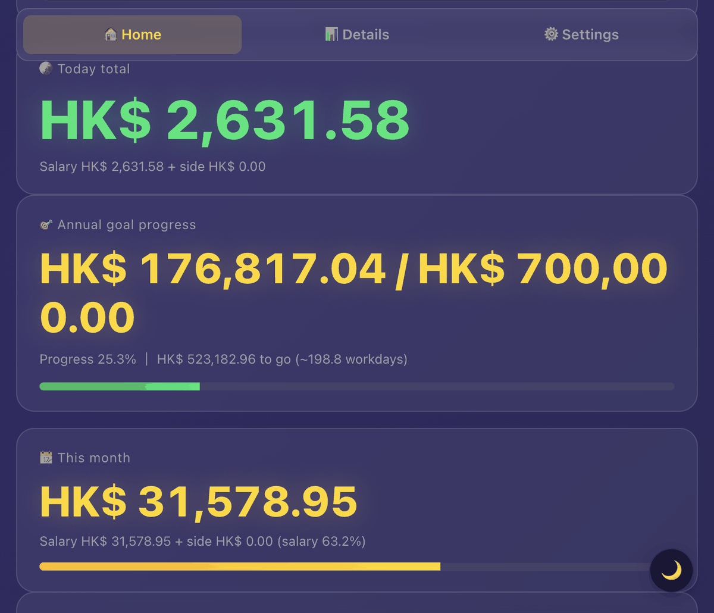
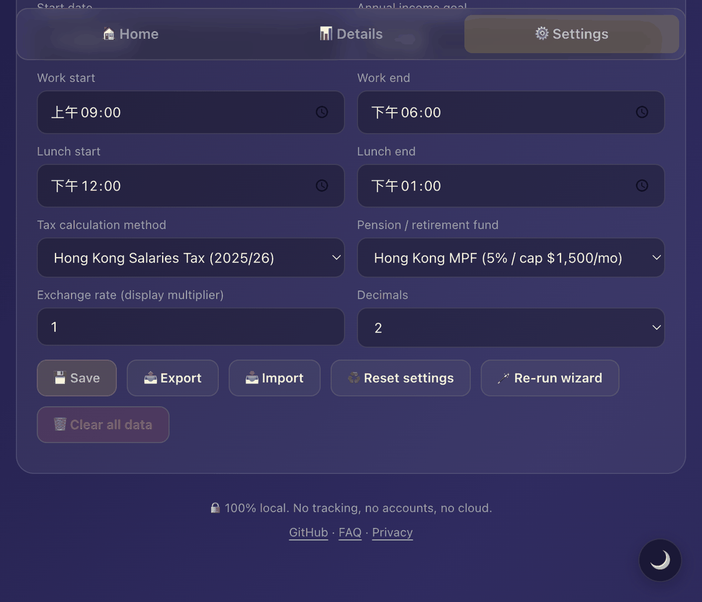

<div align="center">


# 💰 PayPulse

### *Your salary, ticking live.*

[](./LICENSE)
[](./index.html)
[](./docs/privacy.md)
[](#languages-currencies--regions)
[](./docs/regions.md)

[🇬🇧 English](./README.md) · [🇨🇳 简体中文](./README.zh-CN.md) · [🇭🇰 繁體中文](./README.zh-HK.md)

[**Live Demo**](https://ggnode.github.io/paypulse/) · [**Docs**](./docs/) · [**Report a Bug**](https://github.com/GGNode/paypulse/issues)

</div>

---

Most salary calculators spit out one number and call it a day. PayPulse does something different: it shows you the money you've already earned — right now, this second, ticking up in real time. Open it on a Friday afternoon and watch that number climb to the day's end. It's weirdly satisfying.

No backend, no build step, no account. Just a single `index.html` that you open in a browser.

---

## What it looks like

<table>
<tr>
<td align="center" width="33%">
<br>
<b>Live ticker</b><br>
<sub>The big number goes up every second. Below it: daily progress bar, countdown to end of work, next public holiday.</sub>
</td>
<td align="center" width="33%">
<br>
<b>Month & annual goal</b><br>
<sub>Four summary cards — today's total, this month so far, your annual target, and whether you're on pace.</sub>
</td>
<td align="center" width="33%">
<br>
<b>Earnings chart</b><br>
<sub>Cumulative curve drawn in SVG from scratch. No Chart.js, no D3, nothing to install.</sub>
</td>
</tr>
<tr>
<td align="center">
<br>
<b>Monthly breakdown</b><br>
<sub>Gross, tax, pension contribution, net take-home and total asset growth, all month by month.</sub>
</td>
<td align="center">
<br>
<b>Tax breakdown</b><br>
<sub>Every allowance, every deduction, your marginal rate, and (for HK) a TVC savings table.</sub>
</td>
<td align="center">
<br>
<b>Pluggable tax & pension</b><br>
<sub>Swap HK Salaries Tax for China IIT, a flat rate, or your own bracket table — one dropdown.</sub>
</td>
</tr>
</table>

---

## Quick start

### In a browser

```bash
git clone https://github.com/GGNode/paypulse.git
cd paypulse
open index.html          # macOS
xdg-open index.html      # Linux
start index.html         # Windows
```

First time you open it, a short setup wizard appears and asks for your salary, region, and start date. That's the only configuration needed.

<table>
<tr>
<td align="center" width="33%"><br><sub>Pick your language</sub></td>
<td align="center" width="33%"><br><sub>Pick your region — tax, pension and holidays fill in automatically</sub></td>
<td align="center" width="33%"><br><sub>Enter monthly salary and your start date</sub></td>
</tr>
</table>

### Live demo

👉 [ggnode.github.io/paypulse](https://ggnode.github.io/paypulse/)

### macOS desktop widget (optional)

If you want the number floating on your desktop instead of in a browser tab:

```bash
cd desktop
bash setup.sh                     # one-time setup — creates .venv, installs deps
./install-autostart.command       # installs a LaunchAgent so it starts on login
```

See [`desktop/README.md`](./desktop/README.md) for the full guide.

---

## Languages, currencies & regions

### Languages

| Code | Language | Status |
|------|----------|--------|
| `en` | English | ✅ complete |
| `zh-CN` | 简体中文 | ✅ complete |
| `zh-HK` | 繁體中文（香港） | ✅ complete |
| anything else | — | PR welcome — it's just one JS object to translate |

<table>
<tr>
<td align="center" width="33%"><br><sub>English</sub></td>
<td align="center" width="33%"><br><sub>简体中文（HK region）</sub></td>
<td align="center" width="33%"><br><sub>简体中文（Mainland China, CNY）</sub></td>
</tr>
</table>

### Currencies

`HKD` · `CNY` · `USD` · `EUR` · `JPY` · `GBP` · `SGD` · `AUD` — or type any symbol you want.

### Tax providers

| Provider | What it covers |
|----------|----------------|
| `hk-salaries-tax` | **Hong Kong** Salaries Tax 2025/26 — progressive and standard rate, personal/married/child/dependent allowances, MPF/TVC/home-loan deductions, year-end bonus, TVC savings table |
| `cn-iit` | **Mainland China** 综合所得个人所得税 — 7-bracket progressive annual table, ¥60,000 basic allowance, all 7 categories of 专项附加扣除, separate or combined year-end bonus method, pre-tax 五险一金 integration |
| `simple-brackets` | Generic progressive brackets — you define the table, works anywhere |
| `flat-rate` | One flat percentage, good for freelancers and foreign-contract workers |
| `none` | Gross only, no tax math |

<table>
<tr>
<td align="center" width="50%"><br><sub>Hong Kong Salaries Tax with TVC savings table</sub></td>
<td align="center" width="50%"><br><sub>Mainland China — 综合所得 with year-end bonus taxed separately</sub></td>
</tr>
</table>

Adding your own country's tax logic takes about 100 lines. See [`docs/tax-providers.md`](./docs/tax-providers.md).

### Pension providers

| Provider | What it covers |
|----------|----------------|
| `hk-mpf` | **Hong Kong MPF** — 5 % employee + 5 % employer, capped at HK$1,500/month |
| `cn-social-insurance` | **China 五险一金** — 养老/医疗/失业/工伤/生育/住房公积金, fully configurable bases and rates |
| `flat-percent` | Fixed percentage, for US 401(k) or voluntary contributions |
| `none` | No pension deduction |

<p align="center">
  
  <br><sub>China 五险一金 — bases and rates are editable to match your city (Beijing 2025-2026 defaults shown)</sub>
</p>

### Holiday calendars

Built-in data for 2026: 🇭🇰 Hong Kong · 🇨🇳 Mainland China · 🇺🇸 US · 🇬🇧 UK · 🇸🇬 Singapore · 🇯🇵 Japan.

For China, the 调休 make-up workdays (weekends reassigned as working days by the State Council) are fully handled — if Saturday Feb 14 is a make-up day, it counts as a workday. The exported config splits `holidays` and `makeupWorkdays` into separate arrays so the desktop tools stay in sync.

---

## macOS desktop tools

A browser tab works fine, but the widget lets you keep the number at the corner of your eye without switching windows.

<table>
<tr>
<td width="50%" align="center">
<br>
<b>Desktop widget</b><br>
<sub>Frosted-glass card that sits above the Dock. Visible only on the desktop — it hides when you go fullscreen. Click to open the dashboard; right-click for options.</sub>
</td>
<td width="50%" align="center">
<br>
<b>Menu bar app</b><br>
<sub>Live ticker next to the clock. Dropdown shows today/month/goal totals and a link to the full dashboard.</sub>
</td>
</tr>
</table>

Both tools read `paypulse-config.json`, which you export from the web app under Settings → Export. Whenever you change something in the web app, just export again and right-click → Reload config.

```bash
cd desktop
bash setup.sh
./install-autostart.command    # adds a LaunchAgent for login autostart
```

---

## Privacy

PayPulse makes no network requests, ever. Your salary and all your data stay in `localStorage` in your browser — nothing is sent anywhere.

No analytics, no telemetry, no "anonymous usage data", no ads, no account required. Works fully offline. The entire app is one HTML file you can audit in an afternoon.

Full details in [`docs/privacy.md`](./docs/privacy.md).

---

## Tech stack

| | |
|---|---|
| **Frontend** | Vanilla HTML/CSS/JS — no framework, no build tool |
| **Storage** | `localStorage` only |
| **Charts** | Hand-rolled SVG |
| **i18n** | Flat `I18N` dictionary + `t()` helper — add a language by translating one object |
| **Tax & pension** | Pluggable `TAX_PROVIDERS` / `PENSION_PROVIDERS` objects with `compute`, `renderConfig`, `readConfig` hooks |
| **Desktop widget** | Python + PyObjC (macOS) |
| **Menu bar** | Python + rumps (macOS) |

---

## Docs

| | |
|---|---|
| [`docs/regions.md`](./docs/regions.md) | How to add a new region with your own tax/pension/holiday bundle |
| [`docs/tax-providers.md`](./docs/tax-providers.md) | Tax provider API reference and a template to start from |
| [`docs/privacy.md`](./docs/privacy.md) | Privacy details |
| [`docs/FAQ.md`](./docs/FAQ.md) | FAQ |
| [`CHANGELOG.md`](./CHANGELOG.md) | Version history |
| [`CONTRIBUTING.md`](./CONTRIBUTING.md) | Contribution guide |

---

## Contributing

The easiest contributions:

- **New language** — translate the `I18N` object in `index.html`. Two hours tops.
- **Your country's tax or pension logic** — see [`docs/tax-providers.md`](./docs/tax-providers.md) for the API and a template.
- **Public holiday data** — add entries to the `HOLIDAYS` object. For make-up workdays, add `type: 'workday'` to the entry.
- **Bug reports / feature requests** — [open an issue](../../issues).

See [CONTRIBUTING.md](./CONTRIBUTING.md) for everything else.

---

## Roadmap

- [x] Mainland China IIT (`cn-iit`) + 五险一金 (`cn-social-insurance`)
- [x] First-run onboarding wizard
- [x] macOS desktop widget + menu bar
- [x] 调休 make-up workday support
- [ ] US Federal + State income tax
- [ ] Singapore CPF + IRAS
- [ ] UK PAYE + National Insurance
- [ ] Weekly / bi-weekly pay cycles
- [ ] Hourly employee mode
- [ ] PWA / installable app
- [ ] Windows / Linux desktop widget

Suggest or vote on features in [issues](../../issues).

---

## Dark & light mode

<table>
<tr>
<td align="center" width="50%"><br><sub>Dark</sub></td>
<td align="center" width="50%"><br><sub>Light</sub></td>
</tr>
</table>

---

## License

[MIT](./LICENSE). Do what you want with it. Just don't blame us when your coworkers catch you staring at the number instead of working.

---

<div align="center">

**If this was useful, a star helps more than you'd think. ⭐**

</div>
