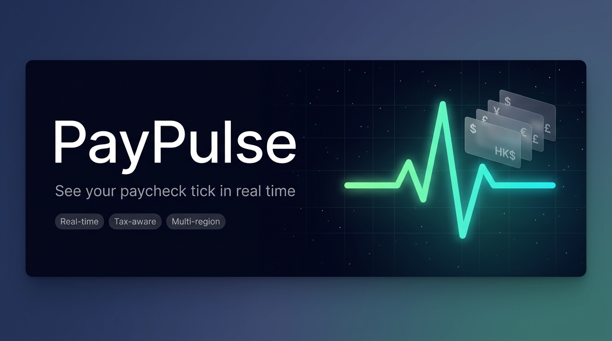
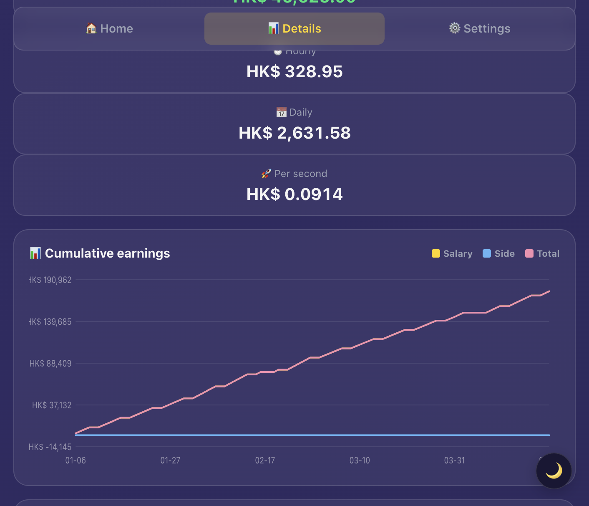
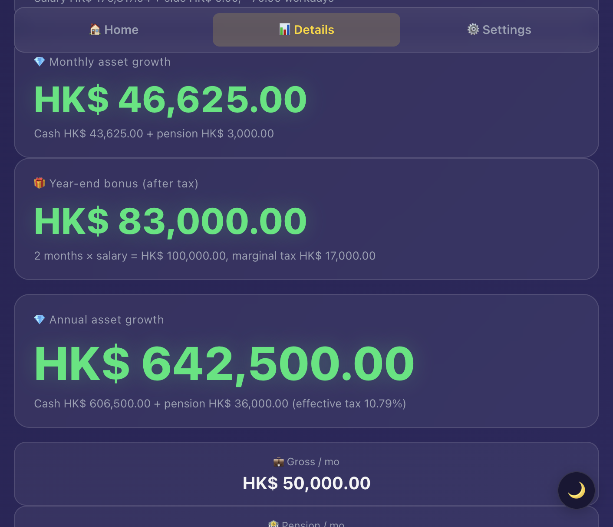
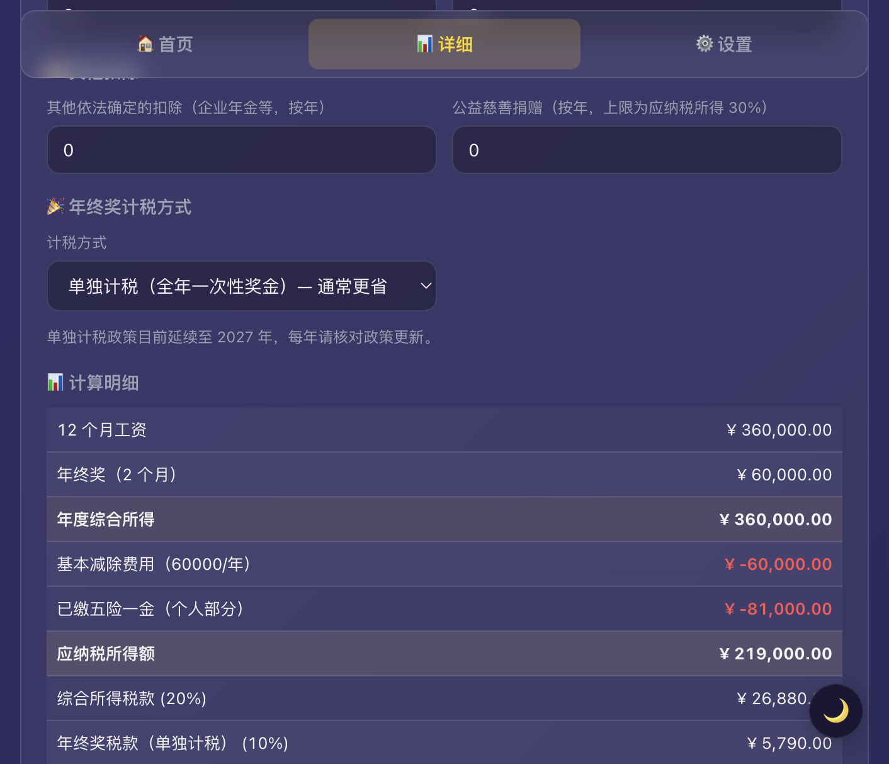
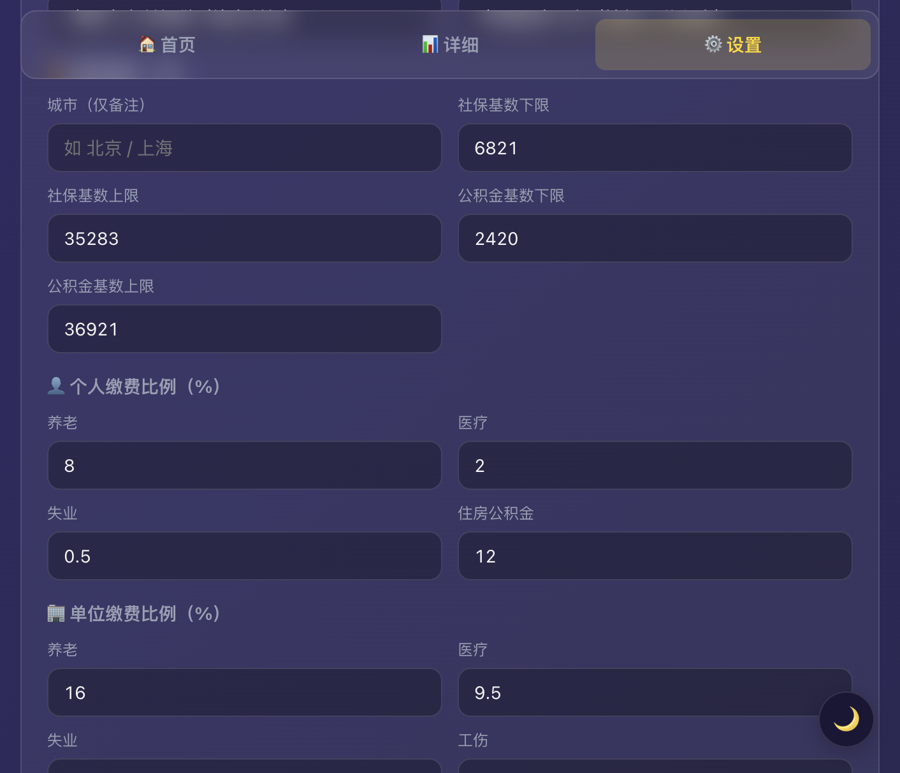
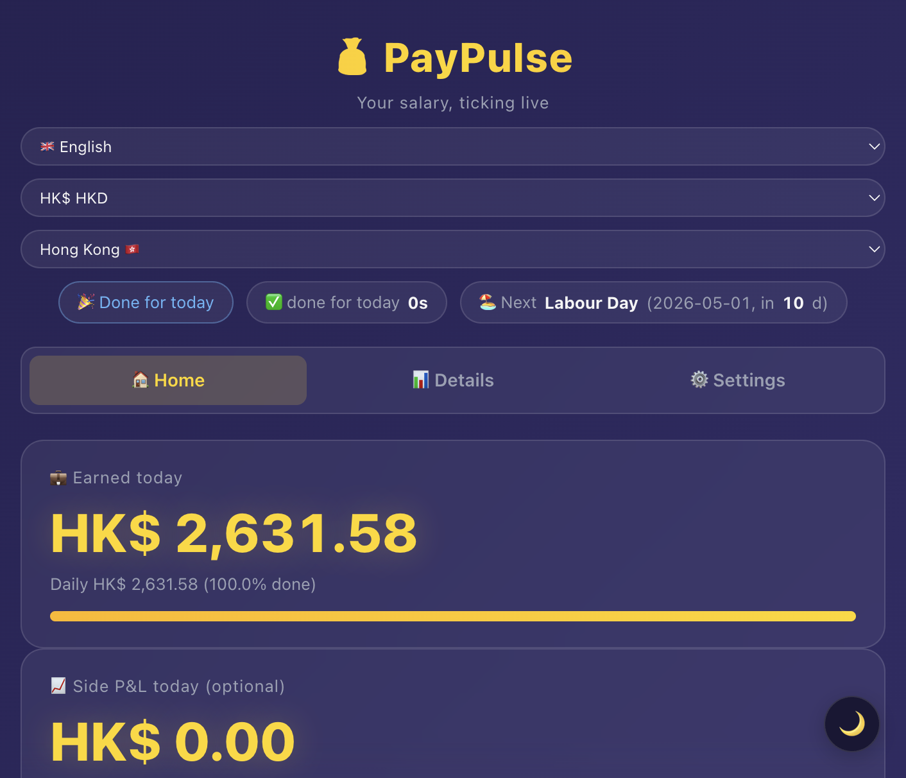
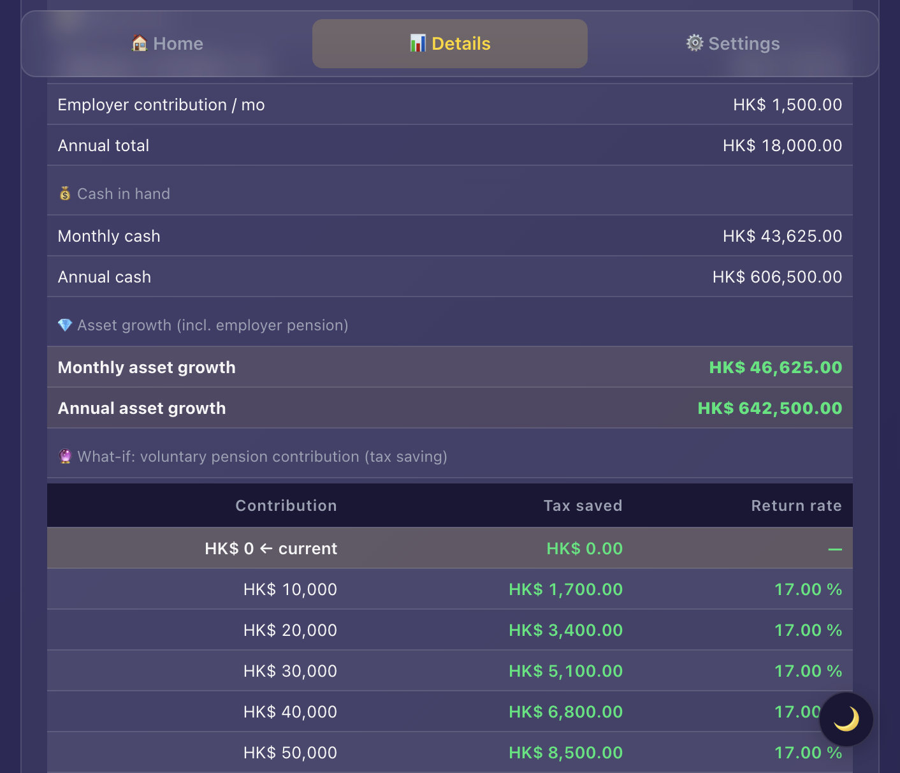
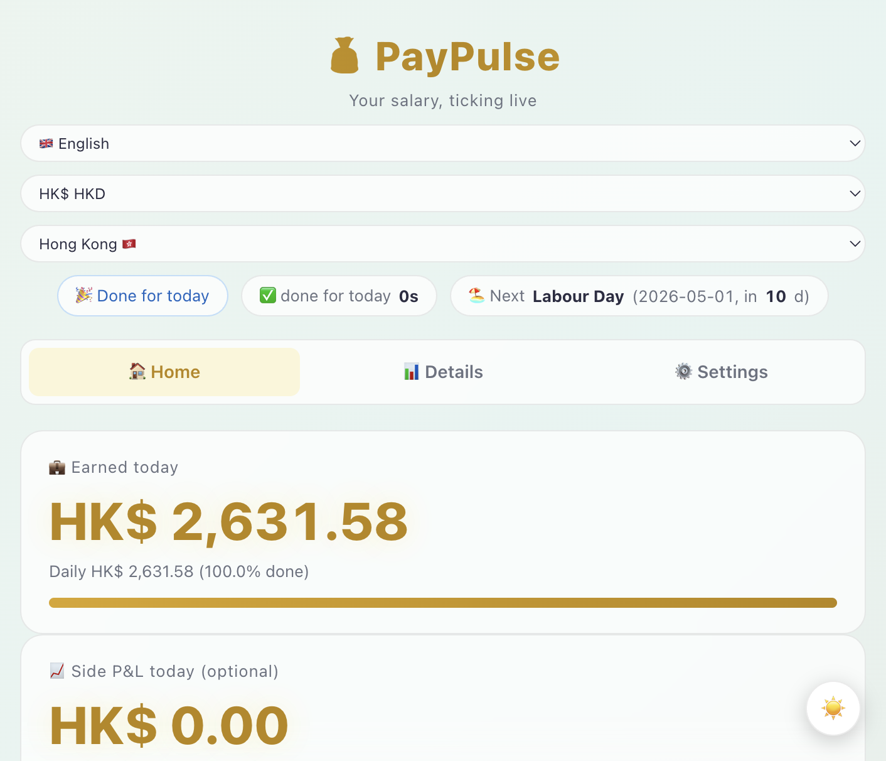

<div align="center">



# 💰 PayPulse

### *看着工资秒秒上涨*

[](./LICENSE)
[](./index.html)
[](./docs/privacy.md)
[](#语言--货币--地区)
[](./docs/regions.md)

[🇬🇧 English](./README.md) · [🇨🇳 简体中文](./README.zh-CN.md) · [🇭🇰 繁體中文](./README.zh-HK.md)

[**在线体验**](https://your-username.github.io/paypulse/) · [**文档**](./docs/) · [**反馈 Bug**](https://github.com/your-username/paypulse/issues)

</div>

---

大多数工资计算器的玩法都一样：填个数字，算一遍，结束。PayPulse 不一样，它让你**实时看着工资往上涨**——每一秒，数字都在动。

周五下午打开它，看着今日收入从下午两点一路爬到下班，挺解压的。

没有后端，不用注册，不需要构建工具，就一个 `index.html`，浏览器打开就能用。

---

## 产品截图

<table>
<tr>
<td align="center" width="33%">
<br>
<b>秒级滚动</b><br>
<sub>大数字每秒跳动，下面是日薪进度条、下班倒计时和下一个节假日。</sub>
</td>
<td align="center" width="33%">
<br>
<b>本月 & 年度目标</b><br>
<sub>四张卡片——今日到手、本月累计、年度目标、当前进度，数据随时更新。</sub>
</td>
<td align="center" width="33%">
<br>
<b>收入走势图</b><br>
<sub>手写 SVG 曲线，没有 Chart.js，没有任何依赖，就是纯数学。</sub>
</td>
</tr>
<tr>
<td align="center">
<br>
<b>月度财务明细</b><br>
<sub>税前、税款、公积金/社保、净到手、资产增长，逐月列清楚。</sub>
</td>
<td align="center">
<br>
<b>税务明细</b><br>
<sub>每一项扣除、每一条免税额、边际税率，全部列出来，不用自己推算。</sub>
</td>
<td align="center">
<br>
<b>五险一金配置</b><br>
<sub>基数上下限、员工/单位比例可以按城市调整，内置北京 2025-2026 默认值。</sub>
</td>
</tr>
</table>

---

## 快速上手

### 浏览器打开（最简单）

```bash
git clone https://github.com/your-username/paypulse.git
cd paypulse
open index.html   # macOS
```

第一次打开会弹出一个设置向导，几个问题走完就配置好了：

<table>
<tr>
<td align="center" width="33%"><br><sub>选语言</sub></td>
<td align="center" width="33%"><br><sub>选地区，税/公积金/节假日自动套用</sub></td>
<td align="center" width="33%"><br><sub>填月薪和入职日期</sub></td>
</tr>
</table>

### 在线体验

👉 [your-username.github.io/paypulse](https://your-username.github.io/paypulse/)

### macOS 桌面部件（可选）

如果你想让数字挂在桌面上而不是一个浏览器标签页里：

```bash
cd desktop
bash setup.sh                     # 一次性安装，创建 .venv，装好依赖
./install-autostart.command       # 装 LaunchAgent，开机自启
```

详见 [`desktop/README.md`](./desktop/README.md)。

---

## 语言 / 货币 / 地区

### 语言

| 代码 | 语言 | 状态 |
|------|------|------|
| `en` | English | ✅ 完整 |
| `zh-CN` | 简体中文 | ✅ 完整 |
| `zh-HK` | 繁體中文（香港） | ✅ 完整 |
| 其他 | — | 欢迎 PR，翻译一个 JS 对象就行 |

<table>
<tr>
<td align="center" width="33%"><br><sub>English</sub></td>
<td align="center" width="33%"><br><sub>简体中文（香港地区）</sub></td>
<td align="center" width="33%"><br><sub>简体中文（中国大陆，CNY）</sub></td>
</tr>
</table>

### 货币

`HKD` · `CNY` · `USD` · `EUR` · `JPY` · `GBP` · `SGD` · `AUD`，也可以自己输入任意符号。

### 税务插件

| 提供方 | 覆盖内容 |
|--------|---------|
| `hk-salaries-tax` | **香港薪俸税 2025/26** — 累进税率/标准税率，个人/已婚/子女/供养父母免税额，MPF/TVC/住房贷款扣除，年终花红，TVC 抵税测算 |
| `cn-iit` | **中国大陆个人所得税** — 综合所得 7 级超额累进，¥60,000 基本减除，全部 7 类专项附加扣除可配置，年终奖单独计税/并入综合所得两种方式，与五险一金税前扣除联动 |
| `simple-brackets` | 通用累进税率表，自己填区间和税率，适合任何国家 |
| `flat-rate` | 固定比例，适合自由职业或外派 |
| `none` | 只显示税前，不做税务计算 |

<table>
<tr>
<td align="center" width="50%"><br><sub>中国大陆 — 综合所得，年终奖单独计税</sub></td>
<td align="center" width="50%"><br><sub>香港薪俸税，含 TVC 抵税测算</sub></td>
</tr>
</table>

想给你所在地区加税务逻辑，大概写 100 行代码。参考 [`docs/tax-providers.md`](./docs/tax-providers.md)。

### 公积金 / 退休金插件

| 提供方 | 覆盖内容 |
|--------|---------|
| `cn-social-insurance` | **中国大陆五险一金** — 养老/医疗/失业/工伤/生育险 + 住房公积金，基数上下限和各项比例全部可调 |
| `hk-mpf` | **香港强积金** — 员工 5% + 雇主 5%，封顶 HK$1,500/月 |
| `flat-percent` | 固定百分比，适合美国 401(k) 或自愿供款 |
| `none` | 不扣公积金 |

<p align="center">
  
  <br><sub>五险一金 — 基数上下限和各项比例可按城市调整（图为北京 2025-2026 默认值）</sub>
</p>

### 节假日

内置 2026 年完整数据：🇭🇰 香港 · 🇨🇳 中国大陆 · 🇺🇸 美国 · 🇬🇧 英国 · 🇸🇬 新加坡 · 🇯🇵 日本。

中国大陆部分按国务院通知，**调休工作日**（如 2026-02-14 周六）正确计为工作日，实际假日和调休日在导出的 JSON 里分开存放，桌面工具读取后也保持一致。

---

## macOS 桌面工具

桌面部件的好处就是不用切窗口，数字就在那儿，低头一瞥就知道了。

<table>
<tr>
<td width="50%" align="center">
<br>
<b>桌面部件</b><br>
<sub>磨砂玻璃小卡，停在 Dock 上方。只有显示桌面时可见，全屏状态下自动隐藏。点击打开完整仪表盘，右键有选项菜单。</sub>
</td>
<td width="50%" align="center">
<br>
<b>菜单栏</b><br>
<sub>数字贴在时钟旁边，一直可见。下拉菜单显示今日/本月/年度汇总，点一下就能打开完整页面。</sub>
</td>
</tr>
</table>

两个工具都读同一份 `paypulse-config.json`，在网页版设置页导出即可。配置有改动的话，导出新的 JSON 替换掉，右键点「重载配置」。

```bash
cd desktop
bash setup.sh
./install-autostart.command    # 可选，装 LaunchAgent 开机自启
```

---

## 隐私

PayPulse 不发任何网络请求。你的工资数据全在浏览器的 `localStorage` 里，不上传、不分析、不统计、不需要注册账号，完全可以离线用。

整个应用就是一个 HTML 文件，代码随时可以看。

完整说明见 [`docs/privacy.md`](./docs/privacy.md)。

---

## 技术栈

| | |
|---|---|
| **前端** | 原生 HTML/CSS/JS，无框架，无构建 |
| **存储** | 只用 `localStorage` |
| **图表** | 手写 SVG |
| **i18n** | 扁平 `I18N` 字典 + `t()` 函数，翻译一个对象就能加新语言 |
| **税/公积金** | 可插拔的 `TAX_PROVIDERS` / `PENSION_PROVIDERS`，提供 `compute`、`renderConfig`、`readConfig` 钩子 |
| **桌面部件** | Python + PyObjC（仅 macOS） |
| **菜单栏** | Python + rumps（仅 macOS） |

---

## 文档

| | |
|---|---|
| [`docs/regions.md`](./docs/regions.md) | 如何新增一个地区，含 HK/CN/US/UK/SG/JP 参考实现 |
| [`docs/tax-providers.md`](./docs/tax-providers.md) | 税务插件 API 和起始模板 |
| [`docs/privacy.md`](./docs/privacy.md) | 隐私政策 |
| [`docs/FAQ.md`](./docs/FAQ.md) | 常见问题 |
| [`CHANGELOG.md`](./CHANGELOG.md) | 更新日志 |
| [`CONTRIBUTING.md`](./CONTRIBUTING.md) | 贡献指南 |

---

## 贡献

几个容易上手的方向：

- **加新语言**：翻译 `index.html` 里的 `I18N` 对象，两小时能搞定。
- **加你所在地区的税务/公积金**：参考 [`docs/tax-providers.md`](./docs/tax-providers.md) 里的 API 和模板。
- **补节假日数据**：往 `HOLIDAYS` 对象里加你所在地区，调休日加上 `type: 'workday'`。
- **Bug 反馈 / 功能建议**：[开个 issue](../../issues) 就行。

详细规范见 [CONTRIBUTING.md](./CONTRIBUTING.md)。

---

## 路线图

- [x] 中国大陆个税（`cn-iit`）+ 五险一金（`cn-social-insurance`）
- [x] 首次使用向导
- [x] macOS 桌面部件 + 菜单栏
- [x] 调休工作日支持
- [ ] 美国联邦/州税
- [ ] 新加坡 CPF + IRAS
- [ ] 英国 PAYE + National Insurance
- [ ] 周薪/双周薪模式
- [ ] 时薪员工模式
- [ ] PWA 可安装版本
- [ ] Windows/Linux 桌面部件

欢迎在 [issues](../../issues) 投票或提新需求。

---

## 深色 / 浅色

<table>
<tr>
<td align="center" width="50%"><br><sub>深色</sub></td>
<td align="center" width="50%"><br><sub>浅色</sub></td>
</tr>
</table>

---

## 协议

[MIT](./LICENSE)。随便用。如果被老板发现你整天盯着工资数字数秒，那不是我们的锅。

---

<div align="center">

**觉得有用的话点个 Star，真的挺有帮助的。⭐**

</div>
