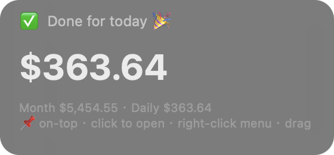
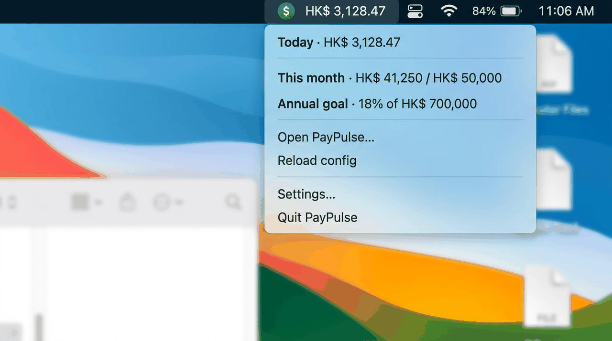

# PayPulse · macOS desktop tools

Two optional tools that complement the web dashboard (`../index.html`):

<table>
<tr>
<td width="50%" valign="top" align="center">
<br>
<b>Desktop widget</b> (<code>widget.py</code>)<br>
<sub>Frosted-glass card pinned above the Dock. Updates every second. Click to open the dashboard, right-click for options, drag to reposition. Auto-hides during fullscreen.</sub>
</td>
<td width="50%" valign="top" align="center">
<br>
<b>Menu bar app</b> (<code>menubar.py</code>)<br>
<sub>Live ticker next to the clock. Dropdown shows today / month / annual totals and a link to the full dashboard.</sub>
</td>
</tr>
</table>

Both run 100% locally. No network connections, no telemetry, no login.

---

## Requirements

- macOS 12 or later (tested on 15.x, Apple Silicon and Intel)
- Python 3.9+ (ships with modern macOS)

---

## 1. Create your config

Both tools read **`paypulse-config.json`** from this folder. The easiest way to create it:

1. Open `../index.html` in your browser.
2. Complete the setup wizard.
3. Go to **Settings → Export**.
4. Move the downloaded file here and rename it `paypulse-config.json`.

When you change something in the web app, just export again, replace the file, then right-click the widget / menu-bar icon → **Reload config**.

You can also write the JSON by hand — see the schema at the bottom of this file.

---

## 2. Install dependencies (one-time)

```bash
bash setup.sh
```

Creates a `.venv` in this folder and installs `rumps` and `pyobjc-framework-Quartz`. Nothing goes system-wide.

---

## 3. Run

### Desktop widget

```bash
./widget.command     # foreground — logs stay in the Terminal window
./start.command      # background — no terminal window
```

Right-click the widget to get the menu:

- **Display mode**
  - `💻 Normal window` (default) — sits behind other windows, visible when you show the desktop. Clickable and draggable.
  - `📌 Always on top` — floats above everything.
  - `🏖️ Desktop-wallpaper layer` — renders behind all apps. Note: macOS blocks most mouse events at this level, so clicking won't work.
- **Open full dashboard**
- **Reload config**
- **Reset to bottom-left**
- **Quit widget**

The widget hides itself automatically when any window goes fullscreen (e.g. video).
In normal-window mode it restores to the back of the current Space after you
exit fullscreen, so it stays available on "Show Desktop" without jumping in
front of Cursor, Safari, or your active app.

Under the hood, the widget combines fullscreen-window detection with macOS
Space-change notifications. That matters because browsers such as Edge/Safari
can intermittently disappear from Quartz's window list while a video is still
fullscreen; PayPulse keeps the widget hidden until the Space actually changes.

### Menu bar app

```bash
./menubar.command
```

Click the menu-bar item to see a breakdown and open the full dashboard.

### Stop / status

```bash
./stop.command       # kills whatever is running
./status.command     # shows running processes and auto-start status
```

---

## 4. Auto-start on login (optional)

```bash
./install-autostart.command      # enable
./uninstall-autostart.command    # disable
```

Installs a LaunchAgent at `~/Library/LaunchAgents/com.paypulse.widget.plist`. The widget starts on login without opening a Terminal window. `KeepAlive` is `false`, so quitting the widget manually won't cause macOS to relaunch it.

---

## Troubleshooting

**Widget doesn't appear.**
Check `.widget.log` in this folder. Most common causes: `bash setup.sh` wasn't run, or `paypulse-config.json` has a syntax error.

**Clicks on the widget don't work.**
You're probably in "Desktop-wallpaper layer" mode. Right-click and switch back to "Normal window".

**Widget appears over fullscreen video.**
Use the default "Normal window" mode first. If it still happens, open
`.widget.log` and look for lines starting with `hide widget:` or `space
changed:` — they show which fullscreen owner/window PayPulse detected.

**Menu-bar icon is invisible.**
macOS hides overflow menu-bar icons on small screens. Try `⌘-drag` to move other icons out of the way, or quit some menu-bar apps to make room.

**I moved the PayPulse folder.**
Re-run `install-autostart.command` to update the LaunchAgent's path. Until you do, the old path will silently fail on login.

---

## Config schema (hand-written)

If you'd rather write `paypulse-config.json` yourself instead of using the web app export:

```json
{
  "salary": 5000,
  "bonusMonths": 0,
  "startDate": "2026-01-01",
  "workStart": "09:00",
  "workEnd":   "18:00",
  "lunchStart": "12:00",
  "lunchEnd":   "13:00",
  "currency": "USD",
  "currencySymbol": "$",
  "fxRate": 1.0,
  "decimals": 2,
  "holidays": ["2026-01-01", "2026-12-25"],
  "makeupWorkdays": ["2026-02-14"]
}
```

- `holidays` — dates that are off (public holidays, regardless of weekday).
- `makeupWorkdays` — weekend dates that are working days (e.g. China's 调休 make-up days). Takes priority over the "weekends are off" rule.

The web app export wraps everything in `{ "config": {...}, "daily": {...} }`. The desktop tools only read `config` and ignore `daily`.

---

## Privacy

Everything stays on your Mac. The widget and menu-bar app never open a network connection. Your `paypulse-config.json` is the only file they read or write. See [`../docs/privacy.md`](../docs/privacy.md) for the full rundown.
